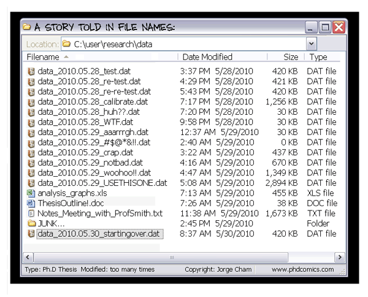

> ## You can skip this lesson if you can answer these question? --->
>
>  - How to keep all your scripts, configuration, notes, and data
>    under version control systems and shareable with your collaborators,
>    and your results automatically verified by continuous integration systems
{: .challenge}

## What is a “version control system" (VCS)?

We all probably do some level of version control of our files,
documents, and even data files, but without a version control **system**
we do it in an ad-hoc manner:

So, in general, VCS systems help to track versions of digital artifacts
such as code (scripts, source files), configuration files, images,
documents, data -- original or generated (as outcome of the analysis).
With proper annotation of changes, VCS becomes the lab notebook for
changing content in the digital world.  Since all versions are stored,
VCS makes it possible to provide any previous version at any later
point in time.  You can see how it could be important for reproducing
previous results -- if your work's history is stored in a VCS, you just
need to get a previous version of your materials and carry out the
analysis using it.  You can also recover a file which you mistakenly
removed since previous version would be contained within VCS, so no
more "the cat ate my source code". For those features alone it is
worthwhile placing any materials you produce and care about under
some appropriate VCS.

Besides tracking changes, another main function of VCS is
collaboration. VCSs are typically used not only locally since they allow
the transfer and aggregation of versions of (or changes to) your
work among collaborators.  By using some public services (such as
github.com) you can also make them available to other online services
that could be configured to react to any new change you
introduce and to perform prescribed actions.  Integration with such
services, which could automatically reanalyse data and
verify that expected results still hold, provides another big benefit for
guaranteeing correct computations and reproducibility.

In this module we will first learn about

- general use of Git as a VCS to maintain not-so-large files (code,
configuration, etc)
- 3rd-party services worth learning to integrate with your VCS on
public hosting portals (e.g. on github)
- VCS geared for managing data files
- additional VCS-based tools that could help you to get better
control of your digital research artifacts and notes.

## Git

> ## External teaching materials
>
> To gain a good general working knowledge of VCS and Git in
> particular, please go through following lesson and a tutorial:
>
> - [Software Carpentry: Version Control with Git (full: 2:30h, familiarize: 20m)](http://swcarpentry.github.io/git-novice/) --
>  a thorough lesson of the main git commands and workflows.  Please
> complete at least until the `Licensing` submodule, which will be a
> separate topic.
> - [Curious git: A curious tale (full: 30m, familiarize: 10m)](https://matthew-brett.github.io/curious-git/curious_journey.html)
>   -- useful read if you feel that "git internals" look like a black box to you.  This example guides you through
>   the principles of Git without talking about Git.
> - (very optional, since this module is Git-based) [Software Carpentry: Version Control with Mercurial (full: 4h)](http://swcarpentry.github.io/hg-novice/)
{: .callout}

## 3rd party services

### Travis
### Circle-CI

## Git-annex

> ## External teaching materials
> -  [git-annex walkthrough](http://git-annex.branchable.com/walkthrough/) -
{: .callout}

## DataLad

> ## External teaching materials
> - [Examples of workflows](http://docs.datalad.org/en/latest/generated/examples/3rdparty_analysis_workflow.html)
{: .callout}

## Additional relevant helpers

- [sumatra](http://neuralensemble.org/sumatra) - manages
  and tracks projects based on numerical simulation or analysis,
  with the aim of supporting reproducible research. It can be thought
  of as an ''automated electronic lab notebook'' for
  simulation/analysis projects.

- [noworkflow](https://github.com/gems-uff/noworkflow) - captures a
  variety of provenance information and provides some analyses such
  as graph-based visualization, differencing over provenance trails,
  and inference queries.

- [etckeeper](http://etckeeper.branchable.com/) - a helper tool for
  anyone administering their Linux-based system, which would store and
  automatically commit any changes within `/etc` into a VCS of your
  choice.  With its help you could track changes in your system
  configuration that could be indispensable during system malfunction
  troubleshooting.

### Neuroimaging ad-hoc "versioning"

### Ad-hoc "version control"

- AFNI captures provenance information within output files that could
  be inspected using `3dinfo` command

